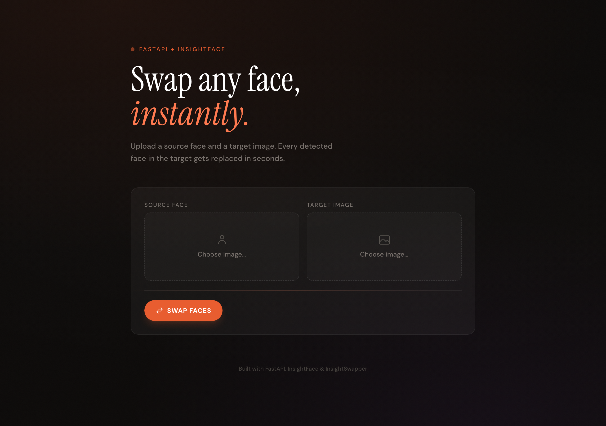

# Face Swap Web App

FastAPI web app for creating face-swapped images with `insightface` and the `inswapper_128.onnx` model.

## Screenshot



## Stack

- `FastAPI` for the web server and upload endpoints
- `Jinja2` for server-rendered HTML
- `insightface` for face analysis and face swapping
- `opencv-python` and `numpy` for image decoding and encoding
- `onnxruntime` for running the pretrained model

## What The App Does

1. Upload a source face image.
2. Upload a target image.
3. Detect the first face in the source image.
4. Detect all faces in the target image.
5. Replace each target face with the source face.
6. Save the generated image and show it in the browser.

## Project Structure

- [`app.py`](/Users/caique.silva/Code/Personal/face-swap/app.py) FastAPI app and face swap service
- [`templates/index.html`](/Users/caique.silva/Code/Personal/face-swap/templates/index.html) upload form and result page
- [`pyproject.toml`](/Users/caique.silva/Code/Personal/face-swap/pyproject.toml) Python dependencies
- `models/inswapper_128.onnx` pretrained swap model (not tracked in git)

## Setup

Install dependencies:

```bash
uv sync
```

Download the `inswapper_128.onnx` model (see [InsightFace in_swapper example](https://github.com/deepinsight/insightface/tree/master/examples/in_swapper) for reference) and place it in the `models/` directory:

```
models/
  inswapper_128.onnx
```

## Run

```bash
uv run uvicorn app:app --reload
```

Open `http://127.0.0.1:8000`.

## Runtime Notes

The app defaults to CPU execution:

```bash
FACE_SWAP_CTX_ID=-1 uv run uvicorn app:app --reload
```

If your environment is configured for GPU inference, set:

```bash
FACE_SWAP_CTX_ID=0 uv run uvicorn app:app --reload
```

## Output

- Generated files are written to `static/generated/`
- The browser page shows the generated image and a download link

## Validation Behavior

- If no face is detected in the source image, the app returns a form error
- If no face is detected in the target image, the app returns a form error
- The source image uses the first detected face only

## Responsible Use

Face swapping can mislead people or violate consent. Use this project only for lawful, ethical, and clearly disclosed purposes.
