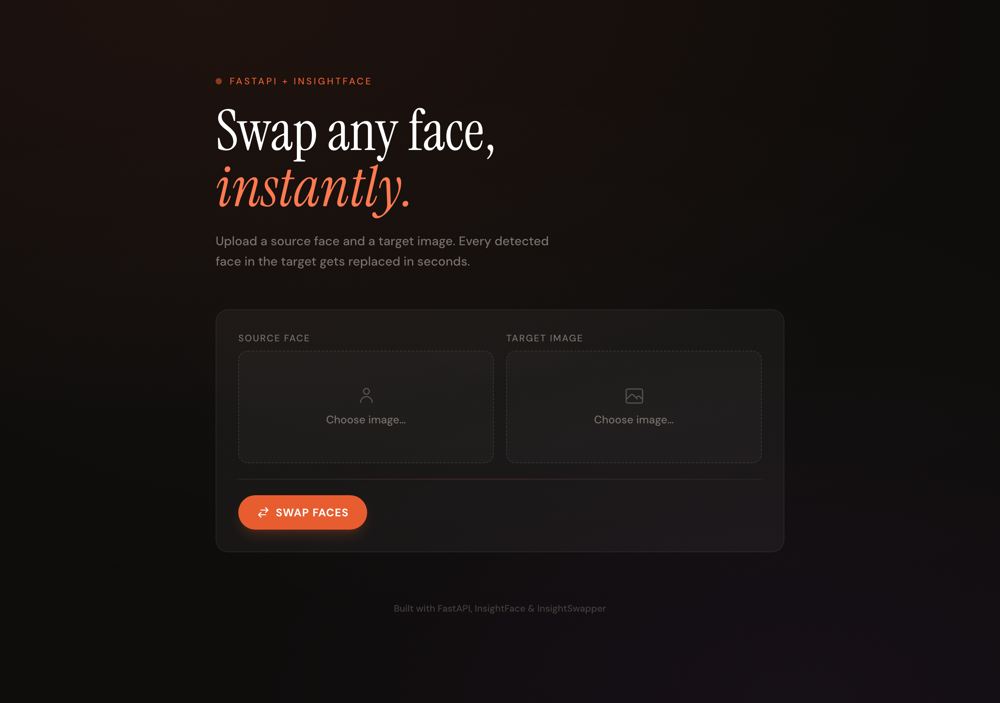

# Face Swap Web App

FastAPI web app for creating face-swapped images with `insightface` and the `inswapper_128.onnx` model.

## Screenshot



## Stack

- `FastAPI` for the web server and upload endpoints
- `Jinja2` for server-rendered HTML
- `insightface` for face analysis and face swapping
- `opencv-python` and `numpy` for image decoding and encoding
- `onnxruntime` for running the pretrained model

## What The App Does

1. Upload a source face image.
2. Upload a target image.
3. Detect the first face in the source image.
4. Detect all faces in the target image.
5. Replace each target face with the source face.
6. Save the generated image and show it in the browser.

## Project Structure

- [`app.py`](/Users/caique.silva/Code/Personal/face-swap/app.py) FastAPI app and face swap service
- [`templates/index.html`](/Users/caique.silva/Code/Personal/face-swap/templates/index.html) upload form and result page
- [`pyproject.toml`](/Users/caique.silva/Code/Personal/face-swap/pyproject.toml) Python dependencies
- `models/inswapper_128.onnx` pretrained swap model (not tracked in git)

## Setup

Install dependencies:

```bash
uv sync
```

Download the `inswapper_128.onnx` model (see [InsightFace in_swapper example](https://github.com/deepinsight/insightface/tree/master/examples/in_swapper) for reference) and place it in the `models/` directory:

```
models/
  inswapper_128.onnx
```

## Run

```bash
uv run uvicorn app:app --reload
```

Open `http://127.0.0.1:8000`.

## Runtime Notes

The app defaults to CPU execution:

```bash
FACE_SWAP_CTX_ID=-1 uv run uvicorn app:app --reload
```

If your environment is configured for GPU inference, set:

```bash
FACE_SWAP_CTX_ID=0 uv run uvicorn app:app --reload
```

## Output

The Docker container runs as a non-root user (UID/GID `10001`). Writable mounts,
including `static/generated/` and the model cache when downloads are needed,
must grant that user write access. Mounted directories retain their own
permissions; the Dockerfile's ownership settings do not apply to them.

- Generated files are written to `static/generated/`
- The browser page shows the generated image and a download link

## Validation Behavior

- If no face is detected in the source image, the app returns a form error
- If no face is detected in the target image, the app returns a form error
- The source image uses the first detected face only

## Resource Limits

Uploads and image URLs share dimension, pixel, and target-face limits. Requests
are counted while received, and uploads/downloads are read with byte caps even
when `Content-Length` is missing or misleading. Oversized requests return a 413
form error; image and face-limit failures return a 400 form error before swapping.

Set these environment variables before starting the app:

| Variable | Default | Unit |
| --- | ---: | --- |
| `FACE_SWAP_MAX_REQUEST_BYTES` | 22020096 (21 MiB) | Bytes, including multipart overhead |
| `FACE_SWAP_MAX_UPLOAD_BYTES` | 10485760 (10 MiB) | Bytes per uploaded image |
| `FACE_SWAP_MAX_DOWNLOAD_BYTES` | 10485760 (10 MiB) | Bytes per downloaded image |
| `FACE_SWAP_MAX_IMAGE_DIMENSION` | 4096 | Pixels per side |
| `FACE_SWAP_MAX_IMAGE_PIXELS` | 16000000 | Total pixels per image |
| `FACE_SWAP_MAX_TARGET_FACES` | 10 | Faces per target image |
| `FACE_SWAP_DOWNLOAD_TIMEOUT_SECONDS` | 15 | Total seconds per URL: DNS, connection, and response body |
| `FACE_SWAP_DOWNLOAD_IDLE_TIMEOUT_SECONDS` | 5 | Seconds without network progress |

Byte, pixel, and face settings must be positive integers; timeout settings must
be positive finite numbers. Invalid settings fail startup before model loading.
Image headers are checked before decoding, and OpenCV has matching allocation
limits. URL downloads request uncompressed HTTP responses and reject unexpected
content encodings. URLs must resolve only to public internet addresses; downloads
connect to those validated addresses, retain the original Host/TLS identity,
ignore environmental proxies, and reject redirects. Provide a direct image URL.
The first detected source face is used; excessive target
faces are rejected rather than silently omitted.

For example, allow at most five target faces and ten seconds per download:

```bash
FACE_SWAP_MAX_TARGET_FACES=5 FACE_SWAP_DOWNLOAD_TIMEOUT_SECONDS=10 uv run uvicorn app:app
```

Run boundary checks without downloading or running pretrained models:

```bash
uv run python -m unittest -v
```

The tests use real image decoders and a loopback HTTP server for timeout checks.

## Responsible Use

Face swapping can mislead people or violate consent. Use this project only for lawful, ethical, and clearly disclosed purposes.
